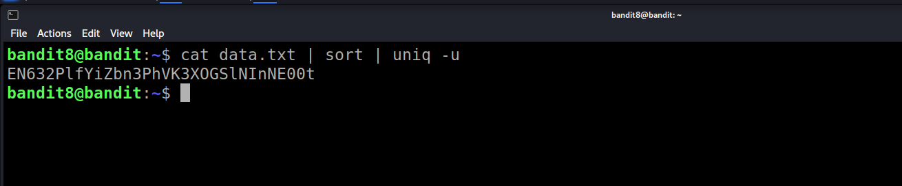
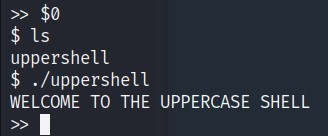

## NGUYEN VAN THO - 20521974
## BUI TAN HAI DANG  - 20520173

## Level 0

ssh tới server thông qua port 2220 với username là bandit0 và password là bandit0

```console
ssh bandit0@bandit.labs.overthewire.org -p 2220
bandit0@bandit.labs.overthewire.org's password: bandit0 
```

### Level 0 → Level 1

Đọc file readme và lấy password

```console
bandit0@bandit:~$ cat readme
NH2SXQwcBdpmTEzi3bvBHMM9H66vVXjL
```
### Level 1 → Level 2

Đọc file ```-``` và lấy password

```console
bandit1@bandit:~$ cat ./-
rRGizSaX8Mk1RTb1CNQoXTcYZWU6lgzi
```

### Level 2 → Level 3

Đọc file ```spaces in this filename``` và lấy password

```console
bandit2@bandit:~$ cat 'spaces in this filename'
aBZ0W5EmUfAf7kHTQeOwd8bauFJ2lAiG
```

### Level 3 → Level 4

Dùng lệnh ls -al để hiện file ẩn

```console
bandit3@bandit:~/inhere$ ls -al
total 12
drwxr-xr-x 2 root    root    4096 Sep  1 06:30 .
drwxr-xr-x 3 root    root    4096 Sep  1 06:30 ..
-rw-r----- 1 bandit4 bandit3   33 Sep  1 06:30 .hidden
```

Đọc file ẩn

```console
bandit3@bandit:~/inhere$ cat .hidden 
2EW7BBsr6aMMoJ2HjW067dm8EgX26xNe
```

### Level 4 → Level 5

Đọc tất cả các file trong thư mục để tìm được chuỗi ở dạng human-readable

```console
bandit4@bandit:~/inhere$ cat ./*
lrIWWI6bB37kxfiCQZqUdOIYfr6eEeqR
```

### Level 5 → Level 6

Dùng lệnh find với option -size để tìm kiếm theo size, option -type để tìm kiếm file , ! -excutable để tìm các  file không phải file thực thi

```console
bandit5@bandit:~/inhere$ find ./ -size 1033c -type f ! -executable
./maybehere07/.file2
bandit5@bandit:~/inhere$ cat ./maybehere07/.file2
P4L4vucdmLnm8I7Vl7jG1ApGSfjYKqJU
```

### Level 6 → Level 7

Dùng lệnh find với option -user để tìm kiếm theo chủ sở hữu, -group để tìm kiếm theo group sở hữu, -type f để tìm kiếm file  (không tìm kiếm thư mục)

```console
find / -user bandit7 -group bandit6 -size 33c -type f | grep bandit7
/var/lib/dpkg/info/bandit7.password
bandit6@bandit:~$ cat /var/lib/dpkg/info/bandit7.password
z7WtoNQU2XfjmMtWA8u5rN4vzqu4v99S
```


### Level 7 → Level 8

Dùng grep để tìm đến vị trí của dòng có từ 'millionth'

```console
bandit7@bandit:~$ cat data.txt | grep 'millionth'
millionth       TESKZC0XvTetK0S9xNwm25STk5iWrBvP
```

### Level 8 → Level 9

Sort lại nội dung file theo thứ tự alphabet và dùng lệnh uniq với option -u để tìm các dòng chỉ hiển thị duy nhất một lần.

```console
bandit8@bandit:~$ cat data.txt | sort | uniq -u
EN632PlfYiZbn3PhVK3XOGSlNInNE00t

```

### Level 9 → Level 10

Tìm kiếm các dòng có dấu '=' trong file để thấy password

```console
bandit9@bandit:~$ strings data.txt | grep "="
=id6
========== the
gO=89
5+&R=
V>%=
bu========== password
iwAw=
M'j=_
4iu========== is
b~==P
ED=Fpe
,=fX
x=f+
O=6pF
=do%
:26=
========== G7w8LIi6J3kTb8A7j9LgrywtEUlyyp6s
=@dZ
u-;=
=#U?
2BEK=q
@!6=
```

### Level 10 → Level 11

Đọc nội dung file và decode mã base64 bằng lệnh base64 với option --decode

```console
bandit10@bandit:~$ cat data.txt | base64 --decode
The password is 6zPeziLdR2RKNdNYFNb6nVCKzphlXHBM
```

### Level 11 → Level 12

Dùng lệnh tr như dưới để decrypt ROT13

```console
bandit11@bandit:~$ cat data.txt | tr '[N-ZA-Mn-za-m]' '[A-Za-z]'
The password is JVNBBFSmZwKKOP0XbFXOoW8chDz5yVRv
```

### Level 12 → Level 13

Tạo thư mục il3sor và hexdump file data.txt 

```console
bandit12@bandit:~$ mkdir /tmp/il3sor
bandit12@bandit:~$ xxd -r data.txt /tmp/il3sor/data
bandit12@bandit:~$ cd /tmp/il3sor
```

Kiểm tra file type của file data và giải nén lần 1

```console
bandit12@bandit:/tmp/il3sor$ file data
data: gzip compressed data, was "data2.bin", last modified: Thu Sep  1 06:30:09 2022, max compression, from Unix, original size modulo 2^32 575
bandit12@bandit:/tmp/il3sor$ cp data data.gz
bandit12@bandit:/tmp/il3sor$ gzip -d -f data.gz
```

Tiếp tục kiểm tra file type và giải nén lần 2

```console
bandit12@bandit:/tmp/il3sor$ file data
data: bzip2 compressed data, block size = 900k
bandit12@bandit:/tmp/il3sor$ cp data data.bz2
bandit12@bandit:/tmp/il3sor$ bzip2 -d -f data.bz2
```

Tiếp tục kiểm tra file type và giải nén lần 3

```console
bandit12@bandit:/tmp/il3sor$ file data
data: gzip compressed data, was "data4.bin", last modified: Thu Sep  1 06:30:09 2022, max compression, from Unix, original size modulo 2^32 20480
bandit12@bandit:/tmp/il3sor$ cp data data.gz
bandit12@bandit:/tmp/il3sor$ gzip -d -f data.gz
```

Tiếp tục kiểm tra file type và giải nén lần 4

```console
bandit12@bandit:/tmp/il3sor$ file data
data: POSIX tar archive (GNU)
bandit12@bandit:/tmp/il3sor$ tar -xf data

bandit12@bandit:/tmp/il3sor$ ls
data  data5.bin
```

Tiếp tục kiểm tra file type và giải nén lần 5

```console
bandit12@bandit:/tmp/il3sor$ file data5.bin 
data5.bin: POSIX tar archive (GNU)
bandit12@bandit:/tmp/il3sor$ tar -xf data5.bin
```

Tiếp tục kiểm tra file type và giải nén lần 6

```console
bandit12@bandit:/tmp/il3sor$ file data6.bin 
data6.bin: bzip2 compressed data, block size = 900k
bandit12@bandit:/tmp/il3sor$ bzip2 -d -f data6.bin
```

Tiếp tục kiểm tra file type và giải nén lần 7

```console
bandit12@bandit:/tmp/il3sor$ file data6.bin.out
data6.bin.out: POSIX tar archive (GNU)
bandit12@bandit:/tmp/il3sor$ tar -xf data6.bin.out

bandit12@bandit:/tmp/il3sor$ ls
data  data5.bin  data6.bin.out  data8.bin
```

Tiếp tục kiểm tra file type và giải nén lần 8

```console
bandit12@bandit:/tmp/il3sor$ file data8.bin
data8.bin: gzip compressed data

bandit12@bandit:/tmp/il3sor$  cp data8.bin data8.bin.gz
bandit12@bandit:/tmp/il3sor$ ls
data  data5.bin  data6.bin.out  data8.bin  data8.bin.gz
bandit12@bandit:/tmp/il3sor$ gzip -d -f data8.bin.gz
```

Kiểm tra file type thấy đã giải nén về file text rồi, ta cat file để lấy flag

```console

bandit12@bandit:/tmp/il3sor$ file data8.bin 
data8.bin: ASCII text
bandit12@bandit:/tmp/il3sor$ cat data8.bin 
The password is wbWdlBxEir4CaE8LaPhauuOo6pwRmrDw
```

### Level 13 → Level 14

Kiểm tra file ẩn ta thấy được ssh private key để log in vào level tiếp theo

```console
bandit13@bandit:~$ ls -al
total 24
drwxr-xr-x  2 root     root     4096 Sep  1 06:30 .
drwxr-xr-x 49 root     root     4096 Sep  1 06:30 ..
-rw-r--r--  1 root     root      220 Jan  6  2022 .bash_logout
-rw-r--r--  1 root     root     3771 Jan  6  2022 .bashrc
-rw-r--r--  1 root     root      807 Jan  6  2022 .profile
-rw-r-----  1 bandit14 bandit13 1679 Sep  1 06:30 sshkey.private
```

### Level 14 → Level 15

Tiếp tục ở user bandit13, dùng private key để ssh vào server với vai trò user bandit14 và gửi password đến port 30000 bằng netcat

```console
bandit13@bandit:~$ ssh -i sshkey.private bandit14@bandit.labs.overthewire.org -p 2220

bandit14@bandit:~$ cat /etc/bandit_pass/bandit14 | nc localhost 30000
Correct!
jN2kgmIXJ6fShzhT2avhotn4Zcka6tnt
```


### Level 15 → Level 16

Dùng password ở level trên gửi đến port 30001 qua ssl để lấy password cho level tiếp theo

```console
bandit15@bandit:~$ echo jN2kgmIXJ6fShzhT2avhotn4Zcka6tnt | openssl s_client -connect localhost:30001  -ign_eof

read R BLOCK
Correct!
JQttfApK4SeyHwDlI9SXGR50qclOAil1
```


### Level 16 → Level 17

Dùng nmap quét tất cả các cổng từ port 31000 đến port 32000 với option -sV để xem port nào đang dùng service ssl, sau đó gửi password đến port đó để lấy credential cho level tiếp theo

```console
bandit16@bandit:~$ nmap localhost -p 31000-32000 -sV
Starting Nmap 7.80 ( https://nmap.org ) at 2022-10-01 04:18 UTC
Nmap scan report for localhost (127.0.0.1)
Host is up (0.00010s latency).
Not shown: 996 closed ports
PORT      STATE SERVICE     VERSION
31046/tcp open  echo
31518/tcp open  ssl/echo
31691/tcp open  echo
31790/tcp open  ssl/unknown
31960/tcp open  echo

echo JQttfApK4SeyHwDlI9SXGR50qclOAil1 | openssl s_client -connect localhost:31790 -ign_eof
```

### Level 17 → Level 18

Dùng private key có được từ level trên, tạo tệp bandit17 để lưu nó (dùng lệnh gedit để mở file và paste private key vào). Sau đó dùng lệnh diff để xem dòng khác nhau giữa 2 file, và đó chính là passoword.

```console
echo > bandit17
gedit bandit17
```

```console
ssh -i bandit17 bandit17@bandit.labs.overthewire.org -p 2220

diff passwords.*
hga5tuuCLF6fFzUpnagiMN8ssu9LFrdg
```

### Level 18 → Level 19

* Khi kết nối đến ssh ở level18 sử dụng password ở level 17 thì ngay lập tức bị thoát ra. 

* Ta sẽ sử dụng Pseudo-TTY và truy cập thẳng vào **/bin/sh**. Pseudo-TTY là 2 file, 1 file master được sử dụng trên các ứng dụng remote (như SSH), còn file slave sẽ được dùng bởi user process. Và file master có thể sử dụng terminal. Ta sẽ sử dụng /bin/sh nhằm tránh bị block bởi bash


* Sau khi ls -a để thấy được file readme thì cat readme để lấy password cho level 19. 
```console
$ cat readme    
awhqfNnAbc1naukrpqDYcF95h7HoMTrC
```

### Level 19 → Level 20

* Dùng password ở level 18 để vào bandit 19, sau khi login thành công, dùng lệnh ls thì thấy 1 file tên **bandit20-do**


* Dùng lệnh file để kiểm tra tập tin này. 
```console
bandit19@bandit:~$ file bandit20-do 
bandit20-do: setuid ELF 32-bit LSB executable, Intel 80386, version 1 (SYSV), dynamically linked, interpreter /lib/ld-linux.so.2, BuildID[sha1]=532dd885fc767d9543f333a2803588ea6fe2a83f, for GNU/Linux 3.2.0, not stripped
```
Suy ra đây là một file **setuid** có thể thực thi. Thử thực thi file này, ta được 


Ta thấy dù đang ở user bandit19 nhưng ta vẫn có thể thực thi một số lệnh với permision của user bandit20. 
* Vì vậy ta dùng cat để lấy password cho level 20 bằng câu lệnh bên dưới. 
```console
bandit19@bandit:~$ ./bandit20-do cat /etc/bandit_pass/bandit20
VxCazJaVykI6W36BkBU0mJTCM8rR95XT
```
### Level 20 → Level 21
* Sau khi dùng pass ở lv trước để vào bandit 20 thành công, dùng lệnh ls và file thì ta thấy file **suconnect** là file setuid


Thử thực thi tập tin này: 
```console
bandit20@bandit:~$ ./suconnect 
Usage: ./suconnect <portnumber>
This program will connect to the given port on localhost using TCP. If it receives the correct password from the other side, the next password is transmitted back.
```
- Ta thấy usage của file này cần portnumber. Và chương trình này sẽ kết nối tới 1 port ở localhost và so sánh password, nếu giống nhau thì sẽ trả về password cho lv tiếp theo. 

- Ta mở một terminal mới và bật netcat để lắng nghe ở port 4005 và truyền file password của bandit20 vào. Khi file **suconnect** kết nối ở port 4005, password matches và nó trả về password của bandit21.

- Ta thu được pass cho lv 21 là: NvEJF7oVjkddltPSrdKEFOllh9V1IBcq


### Level 21 → Level 22
* Sau khi dùng pass ở lv trước để vào bandit 21 thành công, theo hướng dẫn của đề bài, em di chuyển vào thư mục /etc/cron.d và list ra những tập tin trong đây. Ta thấy có nhiều tập tin đã được định giờ trước trong thư mục này, tuy nhiên ta sẽ kiểm tra loại file của **cronjob_bandit22** và thấy đây là một file text. 
- Ta thử cat nội dung của file này và được kết quả như trong hình


- Nội dung của file **cronjob_bandit22** chứa một đường dẫn tập tin dẫn đến file script **cronjob_bandit22.sh**
- Em thử đọc nội dung của file script này bằng lệnh cat 


- Bên trong file script này, dòng đầu tiên nó cấp quyền cho tập tin **/tmp/t7O6lds9S0RqQh9aMcz6ShpAoZKF7fgv** và ở dòng 2 nó chuyển password của bandit22 vào tập tin này. Do đó, em tiến hành cat tập tin này để lấy pass cho lv 22. 
```console
bandit21@bandit:/etc/cron.d$ cat /tmp/t7O6lds9S0RqQh9aMcz6ShpAoZKF7fgv
WdDozAdTM2z9DiFEQ2mGlwngMfj4EZff
```
### Level 22 → Level 23
* Sau khi dùng pass ở lv trước để vào bandit22 thành công, theo hướng dẫn của đề bài, em di chuyển vào thư mục /etc/cron.d và list ra những tập tin trong đây. Ta thấy có nhiều tập tin đã được định giờ trước trong thư mục này, tuy nhiên ta sẽ kiểm tra loại file của **cronjob_bandit23** và thấy đây là một file text. 
- Ta thử cat nội dung của file này và được kết quả tương tự như lv 22, tuy nhiên nội dung file script khác. 
- Cụ thể, có 2 biến, biến myname và biến target. Biến myname sẽ chứa tên của user bandit hiện tại (whoami). Biến mytarget sẽ chứa một chuỗi được mã hóa md5, chuỗi này là chuỗi "echo I am user $myname". 
- 2 dòng tiếp theo có nội dung là copy password từ /etc/bandit_pass/myname sang /tmp/$mytarget. 


- Ta thử thay đổi biến myname thành bandit23 và thực hiện cat /tmp/$mytarget để xem kết quả như thế nào. 


```console
bandit22@bandit:/etc/cron.d$ cat /tmp/8ca319486bfbbc3663ea0fbe81326349
QYw0Y2aiA672PsMmh9puTQuhoz8SyR2G
```
Ta thu được pass cho lv 23 là: QYw0Y2aiA672PsMmh9puTQuhoz8SyR2G

### Level 23 → Level 24
- Tương tự như lv 22, ta tiến hành đọc file script của **cronjob_bandit24.sh**


- Kịch bản file script gồm biến myname chứa nội dung user bandit. Sau đó chuyển vào thư mục **/var/spool/$myname/foo**. Tại đây,   nó khởi tạo một vòng for có chức năng thực thi và xóa tất cả các scripts có trong thư mục hiện tại. Tuy nhiên, khi nó gặp script của user bandit23, chương trình sẽ timeout 60s trước khi thực thi nó rồi mới xóa. 
 
- Dựa vào ý tưởng này, em tạo 1 file script tại `/tmp/haidang_file/`, nội dung của file này là lấy pass của lv24 và đưa nội dung vào tập tin bandit24_pass mà em đã tạo sẵn. 
- Em sẽ cấp toàn quyền cho cả /tmp/haidang_file và script.sh bằng lệnh `chmod 777 /tmp/haidang_file script.sh`


- Em sẽ copy file này vào `/var/spool/$myname/foo` với mục đích là khi gặp file script em tạo thì tiến trình sẽ timeout60s vì thuộc user bandit23 và thực thi tự động file script này rồi cho password vào đường dẫn em đã tạo sẵn. 

```console
bandit23@bandit:/tmp/haidang_file$ cp script.sh /var/spool/bandit24/foo
```

- Đợi một chút sau đó vào lấy pass cho lv 24 tại đường dẫn đã setup: 

```console
bandit23@bandit:/tmp/haidang_file$ cat bandit24_pass 
VAfGXJ1PBSsPSnvsjI8p759leLZ9GGar
```
### Level 24 → Level 25
- Description của đề bài yêu cầu ta kết nối đến localhost ở port 30002. Để nhận được password của lv25 thì cần có pass của lv24 và một pincode gồm 4 số ngẫu nhiên từ 0000 đến 9999. Mỗi field này cách nhau 1 khoảng trắng. 
- Vì vậy em đã tạo ở 1 file script để bruteforce pincode ở **/tmp/haidang_file**. Nội dung của file script như sau:


-  Sau đó thực thi file script và chuyển pipeline vào kết nối localhost port 30002
```console
bandit24@bandit:/tmp/haidang_file$ bash script_lv24.sh | nc localhost 30002
```
- Đây là kết quả sau khi chạy dòng lệnh trên. 


- Vậy pass cho lv25 đó là **p7TaowMYrmu23Ol8hiZh9UvD0O9hpx8d**

### Level 25 → Level 26
- Sau khi login vào user bandit25, ta thực thi ls thì xuất hiện file bandit26.sshkey là private key để truy cập ssh đến bandit26.


- Ta thực thi ssh đến bandit26 bằng lệnh: 
```console
bandit25@bandit:~$ ssh -i bandit26.sshkey bandit26@bandit.labs.overthewire.org -p 2220
```
- Tuy nhiên khi vừa log in vào thì connection ngay lập tức bị đóng, dựa vào description của đề bài, em tìm hiểu xem shell login của bandit26 là gì bằng lệnh: 


- Tiến hành đọc nội dung của login shell này, ta thấy nó thực thi 
lệnh more và sau đó exit 0 (thoát ra ngay lập tức). 


- Vậy ta có thể bypass bằng cách nào, dựa vào tính năng của more, em thu nhỏ terminal đến mức để nó không thực thi được lệnh exit 0. 

- Vì nó không thoát ra, nên từ đây em có thể đổi cấu hình của login shell bằng editor vim. Các câu lệnh như sau: 

```console
v
:set shell=/bin/sh
:shell
```
- Vậy là ta đã bypass thành công và đã vào được user bandit26. Ta tiến hành lấy password bằng lệnh:

```console
$ cat /etc/bandit_pass/bandit26
c7GvcKlw9mC7aUQaPx7nwFstuAIBw1o1
```
### Level 26 → Level 27

- Sau khi login vào lv26 thành công, dùng lệnh ls em thấy có 1 file bandit27-do. Kiểm tra loại file này thì em thấy đây là một file setuid.

- Giống như cách làm ở lv20, em dễ dàng tìm được password cho 
lv27 là `YnQpBuifNMas1hcUFk70ZmqkhUU2EuaS`


### Level 27 → Level 28

AVanL161y9rsbcJIsFHuw35rjaOM19nR

### Level 28 → Level 29
- Sau khi clone bandit28-git về, em tiến hành ls trong thư mục repo thì thấy file README.md, bên trong là hint để lấy bandit lv 29


- Em tiến hành git log để xem lịch sử toàn bộ quá trình thì phát hiện có tới 3 commit. Đầu tiên là "fix info leak", tiếp theo là "add missing data" và cuối cùng là tạo file README.md 


- Em lần lượt xem nội dung của các lượt git commit bằng lệnh `git show <commit id>`
- Ở lần commit đầu tiên, không có thông tin password. 


- Tuy nhiên khi xem ở commit thứ 2 thì e đã tìm được password cho lv29


- Vậy pass cho lv29 là `tQKvmcwNYcFS6vmPHIUSI3ShmsrQZK8S`

### Level 29 → Level 30

- Sau khi clone bandit29-git về, em tiến hành ls trong thư mục repo thì thấy file README.md, bên trong là hint để lấy bandit lv30


- Ta thấy ở password, có dòng chữ `no passwords in production!` và kiểm tra thì thấy hiện tại đang ở branch **master** - có thể hiểu là password chưa được đưa lên production (master) hay nói cách khác là chưa được merge vào branch master.

- Vì vậy em tiến hành thực thi `git branch -a` để xem tất cả các nhánh ở đây, quan sát em thấy ngoài nhánh master thì còn nhiều nhánh khác nữa, đặc biệt có thể thấy là nhánh dev. 


- Thực thi `git checkout dev` để chuyển sang nhánh dev và list các thư mục tại đây ta đọc được password của lv30 tại README.md


- Vậy pass cho lv30 là `xbhV3HpNGlTIdnjUrdAlPzc2L6y9EOnS`

### Level 30 → Level 31
-  Cũng như các lv trên, sau khi git clone về, em tiếp tục đọc nội dung file README.md tại đây nhưng lần này không có hint.

 

- Em tiến hành `git log` và `git branch -a` nhưng cũng không có manh mối.


- Git còn có một lệnh là `git tag`, sơ lược về lệnh này: 
`Tag là chức năng đặt tên một cách đơn giản của Git, nó cho phép ta xác định một cách rõ ràng các phiên bản mã nguồn (code) của dự án. Ta có thể coi tag như một branch không thay đổi được. Một khi nó được tạo (gắn với 1 commit cụ thể) thì ta không thể thay đổi lịch sử commit ấy được nữa.` 

- Vậy em tiến hành `git tag -l` để xem tất cả các tag tồn tai. Tại đây em thấy tag secret. 
```console
bandit30@bandit:/tmp/haidang_file/lv30/repo$ git tag -l 
secret
```
- Để đọc được nội dung của tag này thì em dùng lệnh `git show <tag>` - ở bài này thì là `git show secret` và nhận được pass cho lv31.

```console
bandit30@bandit:/tmp/haidang_file/lv30/repo$ git show secret 
OoffzGDlzhAlerFJ2cAiz1D41JW1Mhmt
```

### Level 31 → Level 32
- Cũng như lv trên, sau khi git clone về thì em đọc file README.md
- Nhiệm vụ của bài này là push tập tin key.txt lên remote repo


- Tiến hành push, đầu tiên ta sẽ `git add key.txt` để thêm tập tin vào repo. Sau đó `git commit` để lưu lịch sử cho lần push này.  


- Sau đó dùng `git push` để đẩy tất cả những thay đổi lên remote 
repo và ta nhận được password cho lv 32. 


`rmCBvG56y58BXzv98yZGdO7ATVL5dW8y`

### Level 32 → Level 33
- Không giống như các level về git, lv này sẽ vào một shell - nơi mà các câu lệnh đều nhập vào đều được chuyển thành chữ hoa trước khi biên dịch làm cho câu lệnh không thể thực thi. 


- Em thử nhập vào đây một biến môi trường bất kì và quan sát thì thấy đối với các biến môi trường thì shell này thực thi bình thường, không chuyển về in hoa. 


- Như đã biết, biến môi trường `$0` sẽ chứa đường dẫn đến shell đang gọi nó, vì vậy em gọi đến `$0` với mong muốn là lấy được shell ban đầu của hệ thống. 
- Kết quả sau khi gọi `$0` thì đã vào được shell của lv33 và ta thấy uppershell là một shell cũng nằm trong hệ thống này.



- Vậy giờ ta có thể lấy được pass cho lv33 bằng lệnh: 
```console
$ cat /etc/bandit_pass/bandit33
odHo63fHiFqcWWJG9rLiLDtPm45KzUKy
```
### Level 33 → Level 34

DONE

